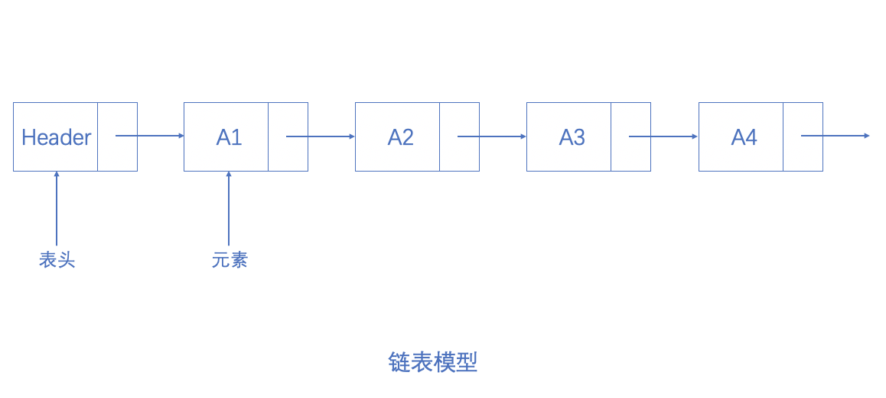
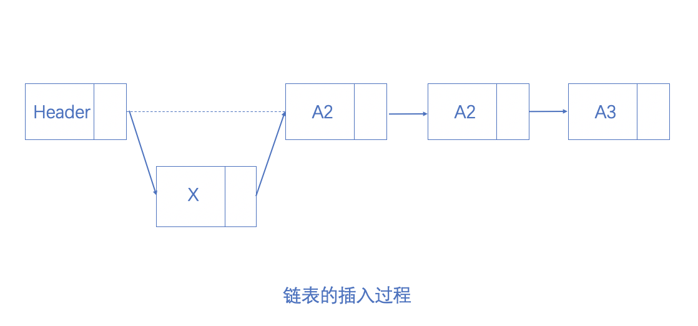
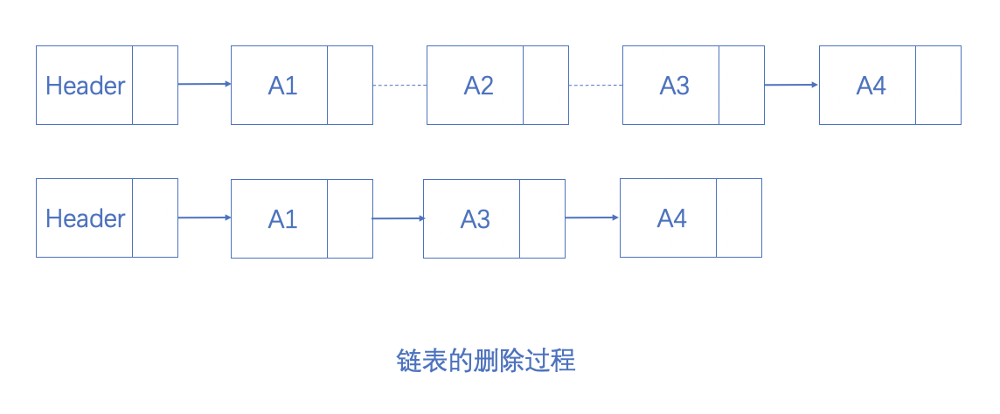
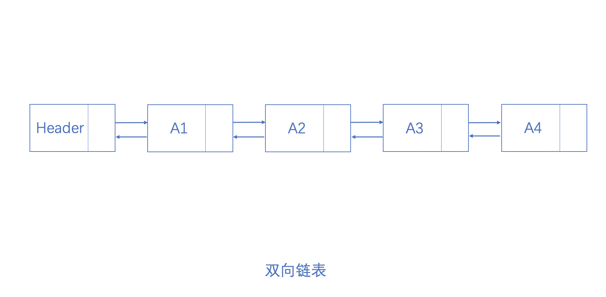
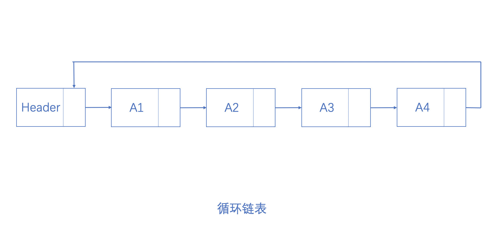

<!-- @format -->

## 链表

链表是由表头和一系列不必在内存中相连的节点组成。每个节点均含有一个表元素（下图中的$A_1$、$A_2$等）和指向后继节点的 Next 指针（下图中的箭头所表示）。最后一个节点的 Next 指针指向 null。

图 1-1 链表模型

### 1.单链表

---

#### 插入

创建新的节点并将其插入到表头之后。

图 1-2 向链表中插入新值$X$，虚线表示原来的 Next 指针

#### 查找

从表头的 Next 指针指向的第一个节点开始，顺序遍历整个链表。若当前节点的值与输入值相等则停止。若下一节点为 null，则表明要查找的值不存在。

#### 删除

为了将某个节点从链表中删除，需要先找出被删除节点的前驱节点，然后将前驱节点的 Next 指针指向被删除节点的后继节点。

图 1-4 从链表中删除$A_2$节点

对于插入操作来说，其运行时间是$O(1)$。而对于查找和删除操作，在最坏情形下的运行时间是$O(N)$，因为若要查找的节点未找到或其位于表的末尾则要遍历整个表。

### 2.双向链表

双链表是在单链表的基础上在每个节点中附加一个指向前驱节点的指针即可。

图 1-2 双向链表模型

### 3.循环链表

将链表中的最后一个节点指向表头就构成了循环链表，并且循环链表还可以是双链表。

图 1-3 循环链表模型

### 代码位置

---

[SouceCode/List/LinkedList](../../../SourceCode/List/LinkedList/LinkedList.ts)
