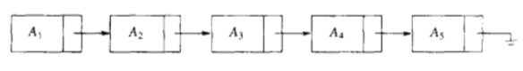
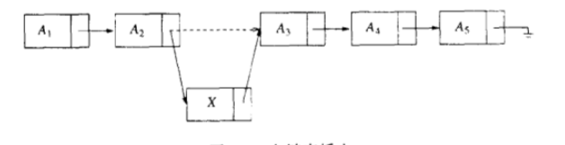
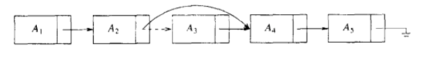

## 表、栈和队列

### 1 链表
---

链表由一系列不必在内存中相连的节点组成。每个节点均含有一个节点值（下图中的$A_1$、$A_2$等）和指向后继节点的指针（下图中的箭头所表示），这里称之为Next指针。最后一个节点的Next指针指向NULL。


图1-1 一个链表


#### 1.1 链表的实现

定义链表中的节点结构：
``` typescript
class LinkedListNode<T> {
    public next: LinkedListNode<T> | null = null;
    public value: T | null = null;
    constructor(value?: T) {
        if (value) {
            this.value = value;
        }
    }
}
```

定义链表并为其添加表头和节点数量：
``` typescript
class LinkedList<T> {
    private head: LinkedListNode<T>;
    private nodeNum: number;
    constructor() {
        this.head = new LinkedListNode()
        this.nodeNum = 0;
    }
```

链表的基本操作：

- **插入**：以$O(1)$的运行时间向链表中插入一个新的节点。


图1-2 在$A_2$节点后向链表中插入

将要插入的节点值与另一节点$P$一起传入，新生成的节点$N$将插入到$P$节点之后。若P未传，则默认将其插入到表头之后。运行时间为$O(1)$。

代码如下：
``` typescript
    public insert(value: T, node?: LinkedListNode<T>): LinkedListNode<T> {
        const frontNode = node ? node : this.head;
        const newNode = new LinkedListNode(value);
        const nextNode = frontNode.next;
        frontNode.next = newNode;
        newNode.next = nextNode;
        this.nodeNum += 1;
        return newNode;
    }
```


- **删除**：为了将某个节点从链表中删除，需要先找出被删除节点的前驱节点。运行时间为$O(N)$。


图1-3 从链表中删除$A_3$节点

代码如下：
``` typescript
    public delete(node: LinkedListNode<T>) {
        const prevNode = this.findPrevNode(node);
        if (!prevNode) {
            return;
        }
        prevNode.next = node.next;
        node.next = null;
        this.nodeNum -= 1;
    }
```

- **查找**：返回链表中的某个节点，运行时间为$O(N)$。
``` typescript
    public find(value: T): LinkedListNode<T> | null {
        let currentNode: LinkedListNode<T> | null = this.head.next;
        while (currentNode !== null && currentNode.value !== value) {
            currentNode = currentNode.next;
        }
        return currentNode;
    }
```


### 2 栈
---
栈（stack）又叫LIFO(后进先出)表，是限制插入和删除只能在表的一个位置上进行，叫做栈的顶（Top）。

<image src="../../Images/ch3/stack.png"/>

图2-1 栈模型：占有栈顶元素是可访问的

#### 2.1 栈的数组实现

定义栈并为其添加数组：
``` typescript
class Stack<T>{
    private capacity: T[] = [];
}
```

栈的基本操作：
- 进栈：向栈顶中插入一个元素
``` typescript
public push(value: T) {
    this.capacity.push(value);
}
```

- 出栈：从栈中删除栈顶元素
``` typescript
public pop() {
    this.capacity.pop();
}
```

### 3 队列
---
队列(queue)是插入在一端进行而删除则在另一端进行的表。

<image src="../../Images/ch3/queue.png"/>

图3-1 队列模型

#### 3.1 队列的数组实现

定义队列并为其添加数组：
``` typescript
export default class Queue<T>{
    private capacity: T[] = []
}
```

队列的基本操作：
- 入队：向数组的末端插入一个元素
``` typescript
public enqueue(value: T) {
    this.capacity.push(value);
}
```

- 出队：删除数组开头的元素
``` typescript
public dequeue() {
    this.capacity.unshift();
}
```

### 代码位置
---
链表：SourceCode/list/linked-list
栈：SourceCode/stack
队列：SourceCode/queue
